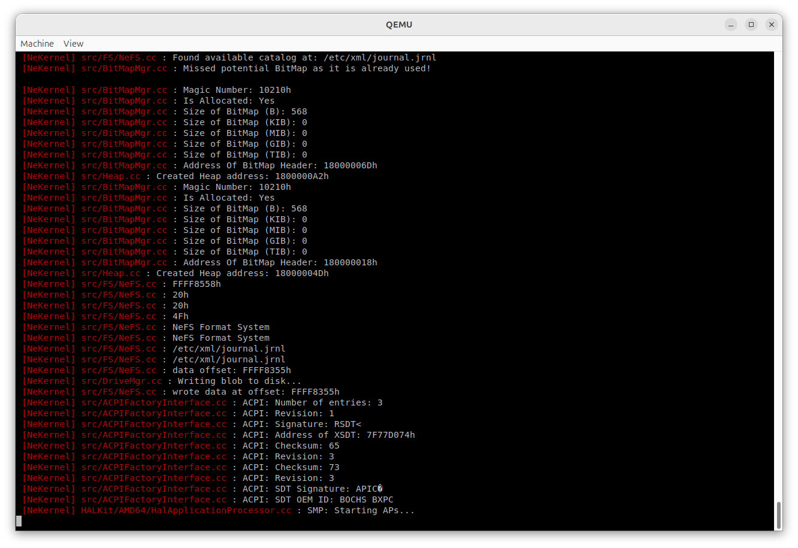
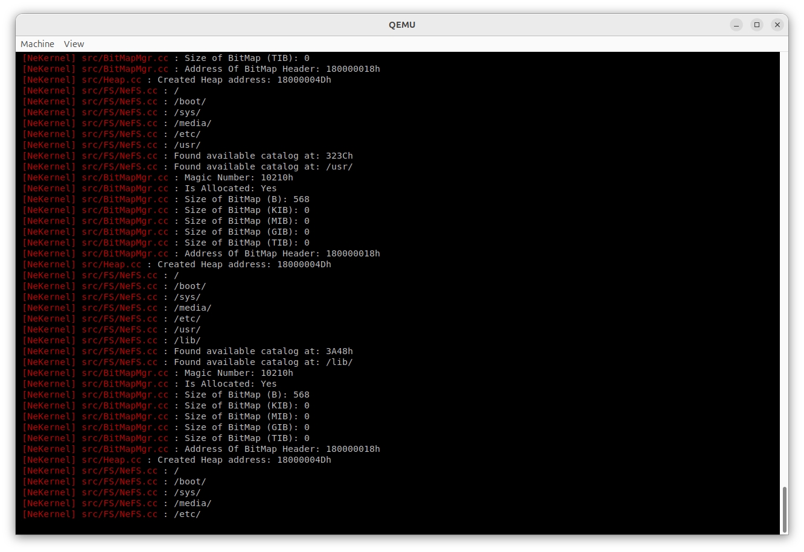

<!-- Read Me of NeKernel -->

# New Kernel Architecture (NeKernel)

## Brief:

A Microkernel written in C++ 20, with a System Call Interface Library, and custom bootloader.

## Screenshots:




## Requirements:

- MinGW/GCC for the Kernel, Boot Loader and the LibSCI.
- Netwide Assembler for the x64 assembly files (in case you're compiling for AMD64).

## Installation:

Clone repository:

```
git clone git@github.com:mediaswirl/openne.git
cd openne
```

</br>

And then select the makefile (arm64 and amd64 are stable and EFI based) to execute:

```
make -f amd64-efi.make all
```

###### Copyright (C) 2024-2025 Amlal EL Mahrouss, all rights reserved. All rights reserved.
